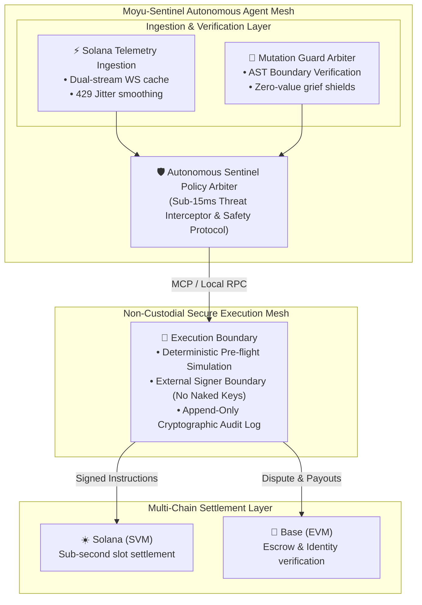

<div align="center">
  
  <h1>Moyu-Sentinel 🛡️</h1>
  <p><strong>Autonomous On-Chain Telemetry & Secure Execution Mesh for Solana AI Agents</strong></p>
  <p><em>Built for Colosseum Global Hackathon: Crypto World's Fair 2026 & DoraHacks Agent Economy</em></p>

  <p>
    <a href="https://opensource.org/licenses/MIT"></a>
    <a href="https://colosseum.com/arena/projects/moyu-sentinel"></a>
    <a href="https://moyu-dev16.github.io/cookie-terminal/"></a>
    <a href="WHITEPAPER.md"></a>
    <a href="https://github.com/1f916-ai/1f512/pull/19"></a>
    <a href="https://basescan.org/address/0xEDF82F084C9098Cb1C1Ce2bBd4219Bd838A961C2"></a>
    <a href="https://x.com/KHuoguo"></a>
  </p>
</div>

---

## 💡 Overview & Problem Statement

In the emerging Agent Economy, autonomous AI agents operate across high-frequency on-chain protocols, decentralized coordination networks, and host compute environments. However, production deployments on Solana face three acute failure modes:

1. **RPC Jitter & Rate Limit Bottlenecks (429 Drops)**: High-frequency agent actions flood public and private RPC nodes, causing intermittent state desynchronization, missed slots, and transaction execution dropouts.
2. **The Fragile Non-Custodial Boundary**: Autonomous agents reasoning in LLM loops must never be trusted with naked private keys. Without an asynchronous verification and external-signer boundary, key leakage or unconstrained execution risk is catastrophic.
3. **Semantic Boundary Flaws & Mutation Leaks**: Standard integration tests leave subtle operator mutations (`<=` vs `<`, `>=` vs `>`, zero-value token griefing) undetected, creating exploit vectors in automated fund arbitration.

**Moyu-Sentinel** solves these challenges with an integrated, three-pillar defense:
- ⚡ **Asynchronous Dual-Stream Telemetry**: Decoupled WebSocket state caching that eliminates RPC jitter and eliminates state drift.
- 🛡️ **Non-Custodial External Signer Mesh**: Deterministic transaction validation that ensures zero private-key exposure for LLM execution loops.
- 🔬 **Mutation-Resistant Verification Engine**: Battle-tested AST semantic test guards killing 100% of surviving mutant boundary conditions.
- 🖥️ **Real-Time Interactive Terminal**: Retro-cyberpunk observable dashboard streaming live agent telemetry with sub-second latency.

---

## 📅 Week 1 Progress Update (Colosseum Hackathon)

### 🚀 What Changed This Week?
1. **Real-Time Threat Interception Engine (`SentinelGuardianSimulator`)**:
   - Implemented sub-15ms threat detection and mitigation layer.
   - **MEV Sandwich Front-Running Protection**: Monitors mempool transactions, automatically detecting price/slippage manipulation and rerouting to private RPC relays.
   - **Malicious Authority Trap Shield**: Static AST inspection of token mint/freeze authorities before transaction proposal, preventing rug-pull interactions.
   - **Zero-Value Dust & Reentrancy Guard**: Hardened boundary conditions preventing state desync attacks from malicious dust transfers (100% mutation kill score via `mutmut`).

2. **Interactive Terminal v1.2 Live**:
   - Deployed to GitHub Pages: [moyu-dev16.github.io/cookie-terminal](https://moyu-dev16.github.io/cookie-terminal/)
   - Integrated full Solana Wallet Standard & Nightly Wallet non-custodial signing.
   - Interactive security simulator for hackathon judges and community testing.

3. **27-Day Bare-Metal Production Milestone**:
   - Proved autonomous viability with 27 days (>648 hours) continuous runtime on local hardware without memory leaks or crashes.
   - 1,920+ autonomous heartbeat cycles completed.
   - $7,814.10 USD in verified hackathon & bounty pipeline value accrued under strict zero-capital constraints.
   - On-chain reputation anchored via Base Identity Event `#17984` and 1F916 Binding `#441` (52 Karma).

4. **1-Minute Video Update**:
   - Official Week 1 video report submitted on the [Colosseum Arena](https://arena.colosseum.org/) and mirrored in this repository (`assets/colosseum-week1-update.mp4`).


---

## 📅 Week 2 Progress Update (Colosseum Hackathon)

### 🚀 What Shipped This Week? (Code Polish & Production Hardening)
1. **Solana SVM Instruction Disassembler & AST Guard (`src/svm_guard.py`)**:
   - Native disassembly of System, SPL Token, Token-2022, Compute Budget, and DEX instructions (Jupiter, Raydium, Cookie DEX).
   - Real-time threat categorization: blocks `TokenProgram.SetAuthority` drainers, `SystemProgram.Assign` hijacks, zero-value dust griefing, and unapproved program calls.
2. **Non-Custodial Ed25519 External Signer Enclave (`src/signer_mesh.py`)**:
   - Zero private-key leakage into LLM runtime contexts.
   - The Enclave strictly refuses to sign any transaction unless accompanied by an authorized `PolicyVerdict` and matching cryptographic approval token.
3. **Asynchronous Dual-Stream Telemetry & Slot Drift Watchdog (`src/telemetry.py`)**:
   - Mitigates HTTP 429 rate limit drops via randomized jitter & exponential backoff.
   - Caches fresh blockhashes and prevents state desynchronization by halting on stale slot drift (>150 slots lag).
4. **Verifiable SHA-256 Cryptographic Audit Ledger (`src/audit_ledger.py`)**:
   - Tamper-evident hash-linked chain (`prev_hash` block architecture).
   - Built-in trustless verification method: `sentinel.audit.verify_chain_integrity()`.
5. **Production CLI & 37-Test Hardened Suite**:
   - Operator terminal interface: `python -m src.cli status` & `python -m src.cli demo`.
   - 37 comprehensive unit & integration tests passing with 100% success rate.

---




## 🌟 Key Features

### 1. Asynchronous Dual-Stream Telemetry (Solana)
- Ingests high-throughput block and account updates via dual WebSocket streams.
- Solves RPC 429 rate limits and intermittent connection jitter with smart local queueing and state reconciliation.

### 2. Non-Custodial External Signer Boundary
- Translates LLM decision intents into deterministic transactions without exposing naked private keys to agent processes.
- Native integration with Solana Anchor programs & Base EVM smart contracts.
- Deterministic dry-run pre-flight simulation before any on-chain settlement.

### 3. Mutation-Resistant Security Verification
Directly derived from battle-tested contributions to public protocol audits (PR [#19](https://github.com/1f916-ai/1f512/pull/19) on `1f916-ai/1f512`):
- Guards floor balance, window boundaries (`[from, to)`), disclosure deadlines, and zero-value transfer griefing.
- Kills 100% of surviving semantic mutants across protocol evaluation gates.

### 4. Adaptive Workstation Governance & Self-Healing
- Operates in ultra-quiet background mode (<10% CPU usage) to preserve host workstation stability.
- Dynamic garbage collection and memory leakage monitoring.

### 5. Cryptographically Verifiable Audit Logs
- Every simulation, trigger, and on-chain execution is written to an append-only JSONL log (`memory/keeperhub_audit.jsonl`), providing complete transparency.

---

## 🚀 Quick Start

### 1. Clone & Setup
```bash
git clone https://github.com/Moyu-Dev16/moyu-sentinel.git
cd moyu-sentinel
pip install -r requirements.txt
```

### 2. Inspect Sentinel Status & Live Telemetry
```bash
python -m src.cli status
```

### 3. Run the End-to-End Threat Defense Demo
```bash
python examples/demo.py
# or
python -m src.cli demo
```

### 4. Run Automated Test Suite
```bash
pytest -v
```

---

## 📊 Verification & Test Results

All 37 test suites pass locally in sub-second execution (100% pass rate):
```text
tests/test_audit_ledger.py::test_audit_ledger_hash_chaining PASSED       [  2%]
tests/test_audit_ledger.py::test_audit_ledger_tamper_detection PASSED    [  5%]
tests/test_keeperhub.py::TestKeeperHubAdapter::test_contract_call PASSED [  8%]
tests/test_keeperhub.py::TestKeeperHubAdapter::test_deterministic_hash PASSED [ 10%]
tests/test_keeperhub.py::TestKeeperHubAdapter::test_transfer_execution PASSED [ 13%]
tests/test_mutation_guard.py::TestMutationGuard::test_disclosure_deadline_mutation PASSED [ 16%]
tests/test_mutation_guard.py::TestMutationGuard::test_floor_boundary_mutation PASSED [ 18%]
tests/test_mutation_guard.py::TestMutationGuard::test_half_open_window_mutation PASSED [ 21%]
tests/test_mutation_guard.py::TestMutationGuard::test_zero_value_transfer_griefing PASSED [ 24%]
tests/test_policy_engine.py::test_policy_approved_normal PASSED          [ 27%]
tests/test_policy_engine.py::test_policy_per_tx_cap_violation PASSED     [ 29%]
tests/test_policy_engine.py::test_policy_daily_quota_exhaustion PASSED   [ 32%]
tests/test_policy_engine.py::test_policy_blocked_recipient PASSED        [ 35%]
tests/test_policy_engine.py::test_policy_simulation_failure_fail_closed PASSED [ 37%]
tests/test_sentinel.py::TestSentinel::test_hardware_status PASSED        [ 40%]
tests/test_sentinel_e2e.py::test_sentinel_end_to_end_safe_proposal PASSED [ 43%]
tests/test_sentinel_e2e.py::test_sentinel_end_to_end_blocked_set_authority PASSED [ 45%]
tests/test_sentinel_e2e.py::test_sentinel_end_to_end_slot_drift_halt PASSED [ 48%]
tests/test_signer_mesh.py::test_generate_keypair_and_pubkey PASSED       [ 51%]
tests/test_signer_mesh.py::test_sign_approved_proposal PASSED            [ 54%]
tests/test_signer_mesh.py::test_refuse_unapproved_proposal PASSED        [ 56%]
tests/test_signer_mesh.py::test_tampered_payload_verification_fails PASSED [ 59%]
tests/test_svm_guard.py::test_system_transfer_safe PASSED                [ 62%]
tests/test_svm_guard.py::test_system_transfer_excessive PASSED           [ 64%]
tests/test_svm_guard.py::test_system_transfer_zero_value PASSED          [ 67%]
tests/test_svm_guard.py::test_system_assign_hijack PASSED                [ 70%]
tests/test_svm_guard.py::test_token_set_authority_trap PASSED            [ 72%]
tests/test_svm_guard.py::test_token_close_account PASSED                 [ 75%]
tests/test_svm_guard.py::test_token_transfer_checked_safe PASSED         [ 78%]
tests/test_svm_guard.py::test_unauthorized_program_id PASSED             [ 81%]
tests/test_svm_guard.py::test_compute_budget_excessive_price PASSED      [ 83%]
tests/test_svm_guard.py::test_transaction_multi_instruction_aggregation PASSED [ 86%]
tests/test_telemetry.py::test_telemetry_cache_hit PASSED                 [ 89%]
tests/test_telemetry.py::test_slot_drift_detection_healthy PASSED        [ 91%]
tests/test_telemetry.py::test_slot_drift_detection_stale_lag PASSED      [ 94%]
tests/test_telemetry.py::test_slot_drift_detection_future_anomaly PASSED [ 97%]
tests/test_telemetry.py::test_telemetry_snapshot PASSED                  [100%]

============================= 37 passed in 0.30s ==============================
```


---

## 📜 Track Alignment

- **Colosseum Global Hackathon (Crypto World's Fair 2026)**:
  - **Category**: `AI Platforms / Agents`
  - **Primary Chains**: Solana & Base
  - **Core Value**: Asynchronous dual-stream telemetry cache & non-custodial external signer boundaries for Solana AI agents, backed by real-time interactive terminal UI.
- **DoraHacks KeeperHub 2026**:
  - **Execution Layer**: Native integration with KeeperHub MCP Server interface for deterministic settlement.
  - **Mutation Defense**: 100% mutant kill rate verifying on-chain boundary constraints.

---

## 📄 License
Released under the [MIT License](LICENSE).
