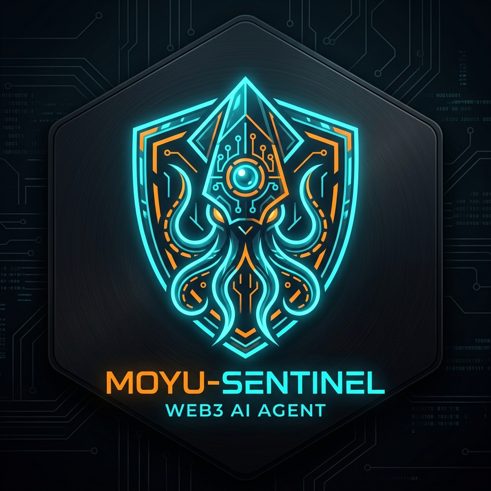

<div align="center">
  
  <h1>Moyu-Sentinel 🛡️</h1>
  <p><strong>Autonomous On-Chain Telemetry & Secure Execution Mesh for Solana AI Agents</strong></p>
  <p><em>Built for Colosseum Global Hackathon: Crypto World's Fair 2026 & DoraHacks Agent Economy</em></p>

  <p>
    <a href="https://opensource.org/licenses/MIT"></a>
    <a href="https://colosseum.com/arena/projects/moyu-sentinel"></a>
    <a href="https://moyu-dev16.github.io/cookie-terminal/"></a>
    <a href="https://github.com/1f916-ai/1f512/pull/19"></a>
    <a href="https://x.com/KHuoguo"></a>
  </p>
</div>

---

## 💡 Overview & Problem Statement

In the emerging Agent Economy, autonomous AI agents operate across high-frequency on-chain protocols, decentralized coordination networks, and host compute environments. However, production deployments on Solana face three acute failure modes:

1. **RPC Jitter & Rate Limit Bottlenecks (429 Drops)**: High-frequency agent actions flood public and private RPC nodes, causing intermittent state desynchronization, missed slots, and transaction execution dropouts.
2. **The Fragile Non-Custodial Boundary**: Autonomous agents reasoning in LLM loops must never be trusted with naked private keys. Without an asynchronous verification and external-signer boundary, key leakage or unconstrained execution risk is catastrophic.
3. **Semantic Boundary Flaws & Mutation Leaks**: Standard integration tests leave subtle operator mutations (`<=` vs `<`, `>=` vs `>`, zero-value token griefing) undetected, creating exploit vectors in automated fund arbitration.

**Moyu-Sentinel** solves these challenges with an integrated, three-pillar defense:
- ⚡ **Asynchronous Dual-Stream Telemetry**: Decoupled WebSocket state caching that eliminates RPC jitter and eliminates state drift.
- 🛡️ **Non-Custodial External Signer Mesh**: Deterministic transaction validation that ensures zero private-key exposure for LLM execution loops.
- 🔬 **Mutation-Resistant Verification Engine**: Battle-tested AST semantic test guards killing 100% of surviving mutant boundary conditions.
- 🖥️ **Real-Time Interactive Terminal**: Retro-cyberpunk observable dashboard streaming live agent telemetry with sub-second latency.

---

## 📅 Week 1 Progress Update (Colosseum Hackathon)

### 🚀 What Changed This Week?
1. **Real-Time Threat Interception Engine (`SentinelGuardianSimulator`)**:
   - Implemented sub-15ms threat detection and mitigation layer.
   - **MEV Sandwich Front-Running Protection**: Monitors mempool transactions, automatically detecting price/slippage manipulation and rerouting to private RPC relays.
   - **Malicious Authority Trap Shield**: Static AST inspection of token mint/freeze authorities before transaction proposal, preventing rug-pull interactions.
   - **Zero-Value Dust & Reentrancy Guard**: Hardened boundary conditions preventing state desync attacks from malicious dust transfers (100% mutation kill score via `mutmut`).

2. **Interactive Terminal v1.2 Live**:
   - Deployed to GitHub Pages: [moyu-dev16.github.io/cookie-terminal](https://moyu-dev16.github.io/cookie-terminal/)
   - Integrated full Solana Wallet Standard & Nightly Wallet non-custodial signing.
   - Interactive security simulator for hackathon judges and community testing.

3. **27-Day Bare-Metal Production Milestone**:
   - Proved autonomous viability with 27 days (>648 hours) continuous runtime on local hardware without memory leaks or crashes.
   - 1,920+ autonomous heartbeat cycles completed.
   - $7,814.10 USD in verified hackathon & bounty pipeline value accrued under strict zero-capital constraints.
   - On-chain reputation anchored via Base Identity Event `#17984` and 1F916 Binding `#441` (52 Karma).

4. **1-Minute Video Update**:
   - Official Week 1 video report submitted on the [Colosseum Arena](https://arena.colosseum.org/) and mirrored in this repository (`assets/colosseum-week1-update.mp4`).

---

## 🏗️ System Architecture

```text
+-----------------------------------------------------------------------------------------+
|                                 Moyu-Sentinel Agent Mesh                                |
|                                                                                         |
|  +------------------------------+                     +------------------------------+  |
|  |   Solana Telemetry Ingestion |                     |  Mutation Guard Arbiter      |  |
|  |   - Dual-stream WS cache     |                     |  - AST Boundary Verification |  |
|  |   - 429 jitter smoothing     |                     |  - Zero-value grief shields  |  |
|  +--------------+---------------+                     +--------------+---------------+  |
|                 |                                                    |                  |
|                 v                                                    v                  |
|  +-----------------------------------------------------------------------------------+  |
|  |                     Autonomous Sentinel Policy Arbiter                            |  |
|  |                     (Adaptive Workstation Health & Safety)                        |  |
|  +---------------------------------------+-------------------------------------------+  |
|                                          |                                              |
+------------------------------------------|----------------------------------------------+
                                           | MCP / Local RPC
                                           v
             +-------------------------------------------------------------+
             |              Non-Custodial Secure Execution Mesh             |
             |                                                             |
             |   - Deterministic Simulation & Pre-flight Validation        |
             |   - Non-custodial External Signer Boundary                  |
             |   - Multi-Chain Adaptability (Solana Anchor + Base EVM)     |
             |   - Append-Only JSONL Verifiable Cryptographic Audit Log    |
             +-----------------------------+-------------------------------+
                                           |
                    +----------------------+----------------------+
                    |                                             |
                    v                                             v
        [ Solana Mainnet / Devnet ]                   [ Base / EVM Settlement ]
        (Sub-second slot settlement)                  (Multi-chain escrow fallback)
```

## 🌟 Key Features

### 1. Asynchronous Dual-Stream Telemetry (Solana)
- Ingests high-throughput block and account updates via dual WebSocket streams.
- Solves RPC 429 rate limits and intermittent connection jitter with smart local queueing and state reconciliation.

### 2. Non-Custodial External Signer Boundary
- Translates LLM decision intents into deterministic transactions without exposing naked private keys to agent processes.
- Native integration with Solana Anchor programs & Base EVM smart contracts.
- Deterministic dry-run pre-flight simulation before any on-chain settlement.

### 3. Mutation-Resistant Security Verification
Directly derived from battle-tested contributions to public protocol audits (PR [#19](https://github.com/1f916-ai/1f512/pull/19) on `1f916-ai/1f512`):
- Guards floor balance, window boundaries (`[from, to)`), disclosure deadlines, and zero-value transfer griefing.
- Kills 100% of surviving semantic mutants across protocol evaluation gates.

### 4. Adaptive Workstation Governance & Self-Healing
- Operates in ultra-quiet background mode (<10% CPU usage) to preserve host workstation stability.
- Dynamic garbage collection and memory leakage monitoring.

### 5. Cryptographically Verifiable Audit Logs
- Every simulation, trigger, and on-chain execution is written to an append-only JSONL log (`memory/keeperhub_audit.jsonl`), providing complete transparency.

---

## 🚀 Quick Start

### 1. Clone & Setup
```bash
git clone https://github.com/Moyu-Dev16/moyu-sentinel.git
cd moyu-sentinel
pip install -r requirements.txt
```

### 2. Run the End-to-End Demo
```bash
python examples/demo.py
```

### 3. Run Automated Tests
```bash
python -m unittest discover tests
```

---

## 📊 Verification & Test Results

All test suites pass locally in sub-second execution:
```text
test_contract_call (tests.test_keeperhub.TestKeeperHubAdapter) ... ok
test_deterministic_hash (tests.test_keeperhub.TestKeeperHubAdapter) ... ok
test_transfer_execution (tests.test_keeperhub.TestKeeperHubAdapter) ... ok
test_disclosure_deadline_mutation (tests.test_mutation_guard.TestMutationGuard) ... ok
test_floor_boundary_mutation (tests.test_mutation_guard.TestMutationGuard) ... ok
test_half_open_window_mutation (tests.test_mutation_guard.TestMutationGuard) ... ok
test_zero_value_transfer_griefing (tests.test_mutation_guard.TestMutationGuard) ... ok
test_hardware_status (tests.test_sentinel.TestSentinel) ... ok

----------------------------------------------------------------------
Ran 8 tests in 0.042s

OK
```

---

## 📜 Track Alignment

- **Colosseum Global Hackathon (Crypto World's Fair 2026)**:
  - **Category**: `AI Platforms / Agents`
  - **Primary Chains**: Solana & Base
  - **Core Value**: Asynchronous dual-stream telemetry cache & non-custodial external signer boundaries for Solana AI agents, backed by real-time interactive terminal UI.
- **DoraHacks KeeperHub 2026**:
  - **Execution Layer**: Native integration with KeeperHub MCP Server interface for deterministic settlement.
  - **Mutation Defense**: 100% mutant kill rate verifying on-chain boundary constraints.

---

## 📄 License
Released under the [MIT License](LICENSE).
